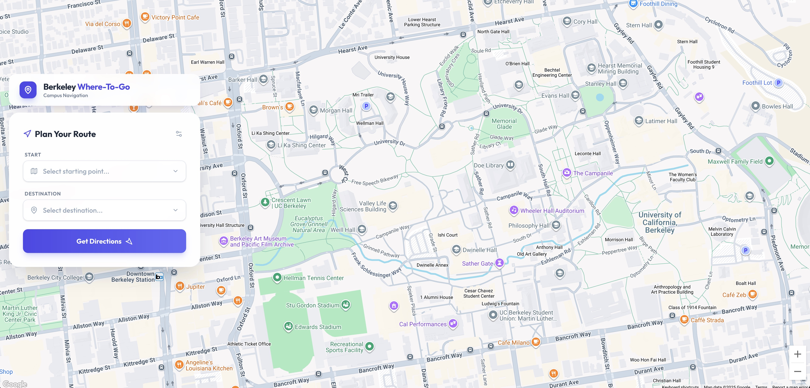
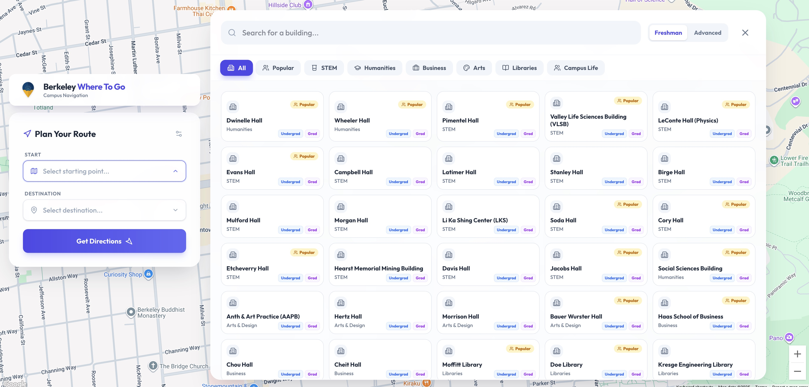
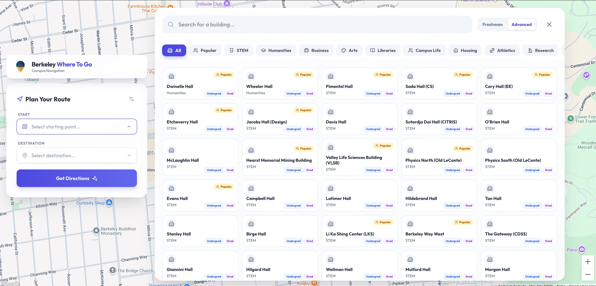
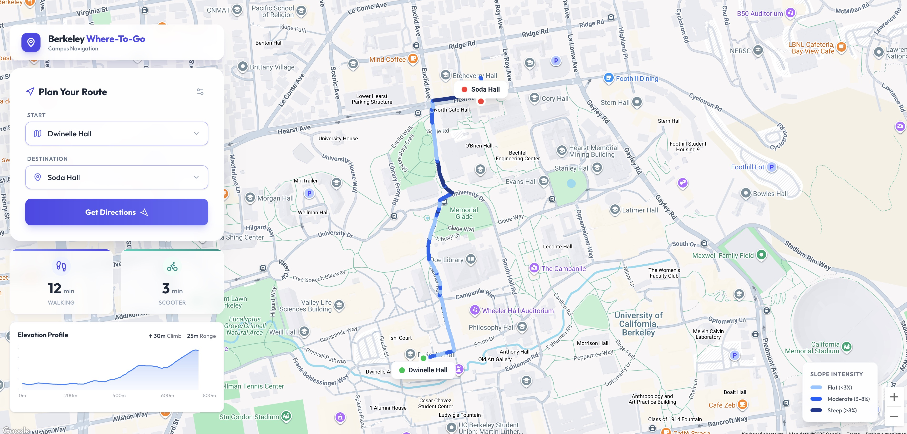

# 🎓 Berkeley Where-To-Go

[🇨🇳 中文版](README_zh.md)

<div align="center">

**Intelligent Campus Route Planning App for UC Berkeley Students**

[](https://reactjs.org/)
[](https://vitejs.dev/)
[](https://tailwindcss.com/)
[](https://developers.google.com/maps)

Helping freshmen and all students easily plan their inter-class routes and arrive on time!

</div>

---

## 📸 Preview






---

## ✨ Core Features

### 🗺️ Smart Map Navigation

- **Deep Google Maps Integration** - Accurate route planning based on real geographic data
- **Slope-Colored Routes** - Route colors change dynamically based on steepness
  - 🔵 **Light Blue**: Flat Route (< 3% slope)
  - 🔵 **Medium Blue**: Moderate Slope (3-8% slope)
  - 🔵 **Dark Blue**: Steep Slope (> 8% slope)
- **Smart Route Markers** - Elegant start/end markers showing full building names
- **Dynamic Marker Positioning** - Markers auto-adjust to avoid obscuring routes

### 📊 Elevation Analysis

- **Interactive Elevation Profile** - Real-time display of route terrain changes
- **Climb Statistics** - Shows total elevation gain and range
- **Slope Legend** - Clear slope grade indicators on map

### 🏢 Smart Building Selector

- **Dual Selection Modes** - Tailored for different needs:
  - 👶 **Freshman Mode**: Curated list of 38 essential buildings for new students
  - 🎓 **Advanced Mode**: Complete database of over 100 campus locations
- **Full-Screen Floating Panel** - Modern building selection interface floating over map
- **Real-Time Search** - Instant building name search filtering
- **Category Browsing** - Comprehensive categorization:
  - 📚 **Academic**: STEM, Humanities, Arts, Business, Libraries
  - 🏠 **Campus Life**: Housing, Dining, Athletics, Student Centers
  - 🔬 **Research**: LBNL, Institutes, Labs
  - 🏛️ **Admin & Landmarks**: Sproul, Campanile, etc.
- **Grid Layout Display** - All buildings at a glance, PC and mobile friendly
- **Smart Interactions** - Support ESC to close, click to toggle, and more

### 🏛️ Building Database

Covers **Over 100 campus buildings** (Advanced Mode), including:

- **Academic Halls**: Dwinelle, Wheeler, Pimentel, VLSB, Evans
- **Engineering**: Soda, Cory, Etcheverry, Jacobs, Hearst Mining
- **Professional Schools**: Haas, Berkeley Law, Optometry
- **Libraries**: Moffitt, Doe, Kresge, East Asian, Bancroft
- **Housing**: Units 1-3, Blackwell, Foothill, Clark Kerr, I-House
- **Athletics**: Memorial Stadium, RSF, Haas Pavilion
- **Research**: LBNL, Space Sciences Lab
- **Landmarks**: Sather Gate, The Campanile

### ⏱️ Precise Time Calculation

- **Multiple Transportation Modes**:

  - 🚶‍♂️ **Walking Time** - Based on real routes and terrain
  - 🛴 **Scooter/Bike** - Fast travel option (~1/4 of walking time)

- **Real-Time API Calculation** - Accurate estimates via Google Maps Directions API

### 🎨 Modern UI Design

- **Glassmorphism Effects** - Elegant blurred backgrounds
- **Smooth Animations** - Silky interactions powered by Framer Motion
- **Responsive Design** - Perfect for desktop, tablet, and mobile

- **Floating Panel Design** - All UI elements with shadow effects, clear hierarchy

---

## 🚀 Quick Start

### Prerequisites

- **Node.js** 18.x or higher
- **Google Maps API Key** with the following APIs enabled:
  - Maps JavaScript API
  - Places API
  - Directions API
  - Elevation API

### Installation

```bash
# 1. Clone the repository
git clone <your-repo-url>
cd berkeley-where-to-go

# 2. Install dependencies
npm install

# 3. Configure environment variables
# Create .env file and add your Google Maps API Key
echo "VITE_GOOGLE_MAPS_API_KEY=your_api_key_here" > .env

# 4. Start development server
npm run dev

# 5. Open in browser
# Usually at http://localhost:5173
```

### Production Build

```bash
# Build for production
npm run build

# Preview production build
npm run preview
```

---

## 📖 Usage Guide

### Basic Operations

1. **Select Start Location**

   - Click "Start" input
   - Floating selection panel appears on the right
   - Use search or categories to find building
   - Click to select, panel closes automatically

2. **Select Destination**

   - Click "Destination" input
   - Select destination in the same way

3. **Get Route**

   - Click "Get Directions" button
   - Wait for route calculation (usually < 2s)

4. **View Results**

   - 🗺️ Map shows slope-coded route
   - ⏱️ Left side shows walking and scooter times
   - 📊 Bottom shows elevation profile
   - 🏷️ View slope legend

---

## 🏗️ Project Structure

```
berkeley-where-to-go/
├── src/
│   ├── components/                    # React Components
│   │   ├── Header.jsx                # Page header
│   │   ├── RouteInput.jsx            # Route input form
│   │   ├── BuildingSelect.jsx        # Building input component
│   │   ├── BuildingSelectionPanel.jsx # Building selection panel
│   │   ├── MapContainer.jsx          # Map container & route rendering
│   │   ├── TravelTimeDisplay.jsx     # Travel time display
│   │   └── ElevationChart.jsx        # Elevation profile chart
│   ├── data/
│   │   └── buildings.js              # 38 campus buildings data
│   ├── App.jsx                       # Main app component
│   ├── main.jsx                      # App entry point
│   └── index.css                     # Global styles
├── public/                           # Static assets
├── .env                              # Environment variables
├── package.json                      # Project dependencies
├── vite.config.js                   # Vite configuration
├── tailwind.config.js               # Tailwind configuration
└── README.md                        # Project documentation
```

---

## 🛠️ Tech Stack

### Core Frameworks

- **React 19.2.0** - Latest React framework with concurrency support
- **Vite 7.2.2** - Fast development build tool
- **TailwindCSS 4.1.17** - Modern utility-first CSS framework

### UI & Animations

- **Framer Motion 12.23.24** - High-performance animation library
- **Lucide React 0.554.0** - Beautiful icon library
- **Recharts 3.4.1** - React data visualization library

### Map Services

- **@react-google-maps/api 2.20.7** - Google Maps React integration
- **Google Maps JavaScript API** - Map display
- **Google Directions API** - Route planning
- **Google Elevation API** - Elevation data fetching

### Development Tools

- **ESLint 9.39.1** - Code quality assurance
- **PostCSS + Autoprefixer** - CSS processing and compatibility

---

## 🎯 Use Cases

### 👶 Freshmen Orientation

- Quickly get familiar with campus geography
- Estimate distance from dorm to class
- Plan routes for the first week

### 📅 Course Planning

- Evaluate inter-class transition time when choosing classes
- Avoid back-to-back classes that are too far apart
- Optimize daily schedule

### 🏃 Daily Commute

- Choose fastest/flattest route
- Decide between walking or biking/scooting
- Understand physical effort of the route

### 🎉 Event Participation

- Quickly find event locations
- Plan route from dorm/parking
- Provide navigation for visitors

---

## 🌍 Deployment Options

### Recommended Platforms

**Vercel** (Recommended) ⭐

```bash
# One-click deployment
npm install -g vercel
vercel
```

**Netlify**

```bash
# Simply drag and drop dist/ folder
npm run build
```

**GitHub Pages**

```bash
# Build and push to gh-pages branch
npm run build
# Deploy dist/ content to GitHub Pages
```

### Environment Variables

When deploying to production, ensure `VITE_GOOGLE_MAPS_API_KEY` is configured in platform settings.

---

## 📊 Performance Metrics

| Metric                 | Value          |
| ---------------------- | -------------- |
| Initial Load Time      | < 3s           |
| Route Calculation Time | < 2s           |
| Elevation Data Fetch   | < 1s           |
| Mobile Compatibility   | ✅ Perfect     |
| Responsive Layout      | ✅ All Devices |
| PWA Support            | 🔄 Extensible  |

---

## 🗺️ Roadmap

### ✅ Completed

- [x] Google Maps Core Integration
- [x] 38 Buildings Database
- [x] Smart Building Selection Panel (Categories, Search)
- [x] Route Planning and Time Calculation
- [x] Elevation Data and Slope Visualization
- [x] Responsive UI Design
- [x] Animations and Interactions
- [x] Custom Map Markers

### 🚧 Planned

- [ ] More Campus Building Data
- [ ] Save Favorite Routes

- [ ] Dark Mode
- [ ] Multi-Language Support (English/Chinese Toggle)
- [ ] PWA Offline Support
- [ ] User Comments and Suggestions

---

## 🤝 Contributing

Issues and Pull Requests are welcome!

### Contribution Workflow

1. **Fork this repository**
2. **Create feature branch**
   ```bash
   git checkout -b feature/AmazingFeature
   ```
3. **Commit changes**
   ```bash
   git commit -m 'Add some AmazingFeature'
   ```
4. **Push to branch**
   ```bash
   git push origin feature/AmazingFeature
   ```
5. **Open Pull Request**

---

## 📝 Changelog

### v1.2.0 (Current - 2025-11)

- ✨ **Advanced Mode** - Complete campus database with over 100 buildings
- ✨ **Dual Selection System** - Switch between Freshman and Advanced views
- ✨ **New Categories** - Added Housing, Athletics, Research, and more
- ✨ **Brand Identity** - New logo and visual refinements

### v1.1.0 (2025-11)

- ✨ New Building Selector UI - Floating Panel Design
- ✨ Building Category System - 8 Categories
- ✨ Real-time Search
- ✨ Grid Layout for All Buildings
- ✨ ESC Shortcut and Smart Interactions
- 🐛 Fixed marker obscuring route issue
- 💄 UI Hierarchy Optimization and Shadow Effects

### v1.0.0 (2025-11)

- ✨ Integrated Google Elevation API
- ✨ Elevation Profile Chart
- ✨ Slope Color-Coded Routes
- ✨ Custom Map Marker System
- ✨ Upgraded to React 19
- ✨ Framer Motion Animations
- ✨ Recharts Integration

### v0.1.0 (Initial)

- Basic Route Planning
- Simple Map Display
- Time Calculation

---

## 📄 License

This project is licensed under the **MIT License** - see the [LICENSE](LICENSE) file for details

---

## 🙏 Acknowledgments

- **UC Berkeley** - Campus data and inspiration
- **Google Maps Platform** - Powerful map and geo services
- **React Community** - Excellent open source tools and libraries
- **All Contributors** - Thanks to every developer who improved this project

---

<div align="center">

**Made with ❤️ for UC Berkeley Students**

🐻 _Go Bears!_ 🐻

> "Helping every Berkeley student arrive on time, no more worrying about inter-class transition times!"

[🐛 Report Issue](https://github.com/your-repo/issues) · [✨ Feature Request](https://github.com/your-repo/issues) · [📖 Documentation](https://github.com/your-repo/wiki)

</div>
